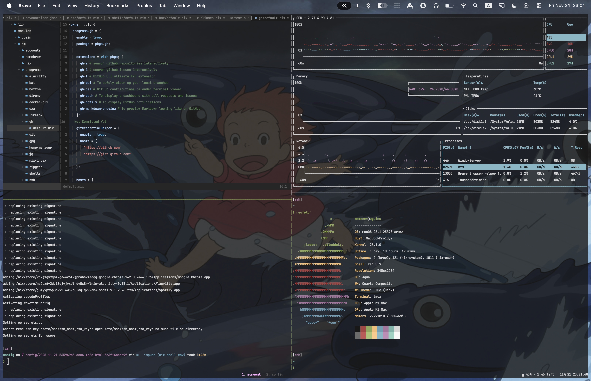

<div align="center">

# ❄️ config

<a href="./README.md">English</a>　|　日本語
<br />
<br />

<br />

[](https://builtwithnix.org)

[](https://github.com/momeemt/config/actions/workflows/ci.yaml)
[](https://github.com/momeemt/config/actions/workflows/image.yaml)
[![DeepWiki](https://img.shields.io/badge/DeepWiki-momeemt%2Fconfig-blue.svg?logo=data:image/png;base64,iVBORw0KGgoAAAANSUhEUgAAACwAAAAyCAYAAAAnWDnqAAAAAXNSR0IArs4c6QAAA05JREFUaEPtmUtyEzEQhtWTQyQLHNak2AB7ZnyXZMEjXMGeK/AIi+QuHrMnbChYY7MIh8g01fJoopFb0uhhEqqcbWTp06/uv1saEDv4O3n3dV60RfP947Mm9/SQc0ICFQgzfc4CYZoTPAswgSJCCUJUnAAoRHOAUOcATwbmVLWdGoH//PB8mnKqScAhsD0kYP3j/Yt5LPQe2KvcXmGvRHcDnpxfL2zOYJ1mFwrryWTz0advv1Ut4CJgf5uhDuDj5eUcAUoahrdY/56ebRWeraTjMt/00Sh3UDtjgHtQNHwcRGOC98BJEAEymycmYcWwOprTgcB6VZ5JK5TAJ+fXGLBm3FDAmn6oPPjR4rKCAoJCal2eAiQp2x0vxTPB3ALO2CRkwmDy5WohzBDwSEFKRwPbknEggCPB/imwrycgxX2NzoMCHhPkDwqYMr9tRcP5qNrMZHkVnOjRMWwLCcr8ohBVb1OMjxLwGCvjTikrsBOiA6fNyCrm8V1rP93iVPpwaE+gO0SsWmPiXB+jikdf6SizrT5qKasx5j8ABbHpFTx+vFXp9EnYQmLx02h1QTTrl6eDqxLnGjporxl3NL3agEvXdT0WmEost648sQOYAeJS9Q7bfUVoMGnjo4AZdUMQku50McDcMWcBPvr0SzbTAFDfvJqwLzgxwATnCgnp4wDl6Aa+Ax283gghmj+vj7feE2KBBRMW3FzOpLOADl0Isb5587h/U4gGvkt5v60Z1VLG8BhYjbzRwyQZemwAd6cCR5/XFWLYZRIMpX39AR0tjaGGiGzLVyhse5C9RKC6ai42ppWPKiBagOvaYk8lO7DajerabOZP46Lby5wKjw1HCRx7p9sVMOWGzb/vA1hwiWc6jm3MvQDTogQkiqIhJV0nBQBTU+3okKCFDy9WwferkHjtxib7t3xIUQtHxnIwtx4mpg26/HfwVNVDb4oI9RHmx5WGelRVlrtiw43zboCLaxv46AZeB3IlTkwouebTr1y2NjSpHz68WNFjHvupy3q8TFn3Hos2IAk4Ju5dCo8B3wP7VPr/FGaKiG+T+v+TQqIrOqMTL1VdWV1DdmcbO8KXBz6esmYWYKPwDL5b5FA1a0hwapHiom0r/cKaoqr+27/XcrS5UwSMbQAAAABJRU5ErkJggg==)](https://deepwiki.com/momeemt/config)

</div>

<br />

システム、ユーザ環境、インフラストラクチャ、複数のノードなどを宣言的に管理する設定群です。

## 設定の反映

> [!WARNING]
> このconfigを試したい場合には、[使ってみる](#%E4%BD%BF%E3%81%A3%E3%81%A6%E3%81%BF%E3%82%8B)セクションで説明されている通り、Dockerコンテナで利用することをおすすめします。
> これらの設定はユーザ名やパス、[クレデンシャル](../secrets)など[作者](https://github.com/momeemt)個人の情報に大きく依存しており、あなたの環境にそのまま適用することはできません。
> ただし、ツールやシステムの設定はモジュールとして切り出されているため、十分にNixの知識がある場合にはこのリポジトリをフォークして、不要なファイルを削除して、設定項目を更新してから、自己責任で設定を反映することもできます。

設定の反映には、[Nix](https://github.com/NixOS/nix) が必要です。
以下のいずれかの方法でNixをインストールしてください。

- [nix-installer](https://github.com/DeterminateSystems/nix-installer) (推奨)
- [Nix Download](https://nixos.org/download/)

また、以下のOSに対する反映をサポートしています。

- [macOS Tahoe](https://www.apple.com/jp/os/macos/)
- [NixOS 25.05](https://nixos.org/download/)

### 初回の反映

まずこのリポジトリをcloneしてください。

```sh
git clone https://github.com/momeemt/config

# もし gh が利用可能な環境なら
gh repo clone momeemt/config

# もし ghq が利用可能な環境なら
ghq get momeemt/config
```

次に、以下のスクリプトを実行して設定を反映させてください。
ただし、一般的な Unix システムに存在する`/bin/bash`に依存します。

```sh
./assets/scripts/apply.sh
```

### 2回目以降の反映

devShell に入ると、タスクランナーツールである [just](https://github.com/casey/just) が利用できるようになります。
2回目以降は以下のコマンドを発行して設定を反映させてください。

```sh
just apply
```

## なぜ Nix/NixOS を選ぶのか

ビルドシステムに対して同じ入力（ソースコード、ビルドマニフェスト）を与えた時、任意の環境でビルドを実行してもビット単位で同一の成果物が得られるようなビルドを、[再現性のあるビルド](https://reproducible-builds.org/)と言います。
[Nix](https://nixos.org/) は再現性のあるビルドを実現するビルドシステムの1つです。

したがって、適切に固定された Nix の設定は、時間が経っても高い再現性で再構築できます。
また、Nix で書かれたこのリポジトリの設定や他のユーザの設定を共有することも容易です。

[home-manager](https://github.com/nix-community/home-manager) を利用すればユーザ空間の設定を、[NixOS](https://nixos.org/download) や [nix-darwin](https://github.com/nix-darwin/nix-darwin) を利用すれば、システム空間の設定をNixで記述して反映させることができます。


Nix が提供する公式のパッケージリポジトリ [nixpkgs](https://github.com/NixOS/nixpkgs) からは、2025年11月現在は[12万件以上のパッケージ](https://search.nixos.org/packages)を利用することができます。
システムの設定には利用せず、便利なパッケージマネージャとして利用するのも一つの手です。
もし興味があれば以下のリソースを参照してください。

- [Nix Tutorials](https://nix.dev/tutorials/) (英語)
- [Nix Reference Manual](https://nix.dev/manual/nix/2.24/) (英語)
- [Nix入門](https://zenn.dev/asa1984/books/nix-introduction) (日本語)
- [Nix入門: ハンズオン編](https://zenn.dev/asa1984/books/nix-hands-on) (日本語)

## 使ってみる

このリポジトリの設定の一部は、仮想環境を利用して試すことができます。

### Docker を利用する

`.devcontainer/Dockerfile` に定義されている Docker イメージは、GitHub Container registry (GHCR) で[公開](https://github.com/momeemt/config/pkgs/container/config)されています。

> [!WARNING]
> 設定の安定版がリリースされた際に、main ブランチにマージされます。
> 現在はまだリリースを行っていないため、当分の間は `unstable` タグのイメージをご利用ください。

```sh
# main ブランチの HEAD
docker pull ghcr.io/momeemt/config:latest

# develop ブランチの HEAD
docker pull ghcr.io/momeemt/config:unstable
```

また、[Development Containers](https://containers.dev/) を利用して、コンテナ内の環境にアクセスすることもできます。

```sh
devcontainer up --workspace-folder .
```

## ドキュメント

設定のドキュメントは以下のリンクからアクセスできます。

> [!WARNING]
> ドキュメントは現在執筆中であり不完全です。

[https://config.momee.mt](https://config.momee.mt)

## 開発する

通常の場合、[nix-direnv](https://github.com/nix-community/nix-direnv) を用いて開発環境に入ることができます。

```sh
echo "use flake" > .envrc
direnv allow
```

また、git サブモジュールとしてローカルにダウンロードした NixOS モジュールを `import` した環境に入る場合には、`.envrc`を次のように変更してから適用します。以下に例を示します。

```sh
cat <<EOF > .envrc
use flake . --override-input tmux-nix path:./nix/flakes/tmux-nix
EOF
direnv allow
```

なお、just を利用して環境定義ファイルを生成できます。

```sh
just env
```

## テンプレート

Nix flake のテンプレートを利用できます。
Rust を用いたプロジェクトの `flake.nix` を生成する例を示します。

```sh
nix flake init --template "github:momeemt/config#rust"
```

## フィードバック

新しい提案や改善があれば[お気軽にどうぞ](https://github.com/momeemt/config/issues)！😌

## ライセンス

このリポジトリのソースコードおよびリソースは、特に明記がない限り [Apache-2.0](https://licenses.opensource.jp/Apache-2.0/Apache-2.0.html) でライセンスされています。
したがって、このリポジトリの内容を商用利用含めた利用・複製・改変・再配布することは自由ですが、著作権表記を残し、ライセンス文を同梱し、変更箇所を明示する必要があります。

ただし、以下のように部分的に異なるライセンスが適用される場合があります。

1. ファイル内に明示的なライセンス表記がある場合、その表記が最も優先されます。
1. サブディレクトリ内に LICENSE ファイルがある場合、そのディレクトリ配下のファイルには、その LICENSE に記載されたライセンスが適用されます。

なお、本ライセンスの適用は利用者の属する地域で許容される範囲に限られます。

## 参考文献

私の設定は、以下のユーザのdotfilesや設定ファイルを参考に実装しました。

- Nix configurations
  - [ryota-ka/dotfiles](https://github.com/ryota-ka/dotfiles)
  - [natsukium/dotfiles](https://github.com/natsukium/dotfiles)
  - [glassesneo/dotfiles](https://github.com/glassesneo/dotfiles)
  - [misumisumi/nixos-desktop-config](https://github.com/misumisumi/nixos-desktop-config)
  - [takeokunn/nixos-configuration](https://github.com/takeokunn/nixos-configuration)
- dotfiles
  - [wasabi315/dotfiles](https://github.com/wasabi315/dotfiles)
- Kubernetes
  - [walnuts1018/infra](https://github.com/walnuts1018/infra)
